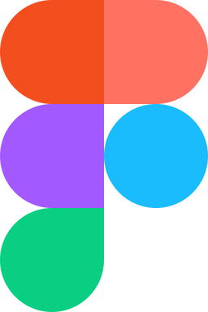

## Hi there 👋 My name is Yuriy and I am full-stack QA engineer.

About me: I picked testing because I’ve always wanted to test games. Then I gave app testing a shot and got hooked right away. It felt simple, makes sense, and it’s super interesting — so I decided to switch gears and go all‑in on this career. 😊

I have working experience with tools:

 
 
 

## 💬 Ways to reach me:

-  <a target="_blank" href="https://t.me/leagen3">@leagen3</a>
- 📝 [Email](mailto:ponomarev-25@yandex.ru)
